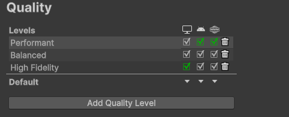
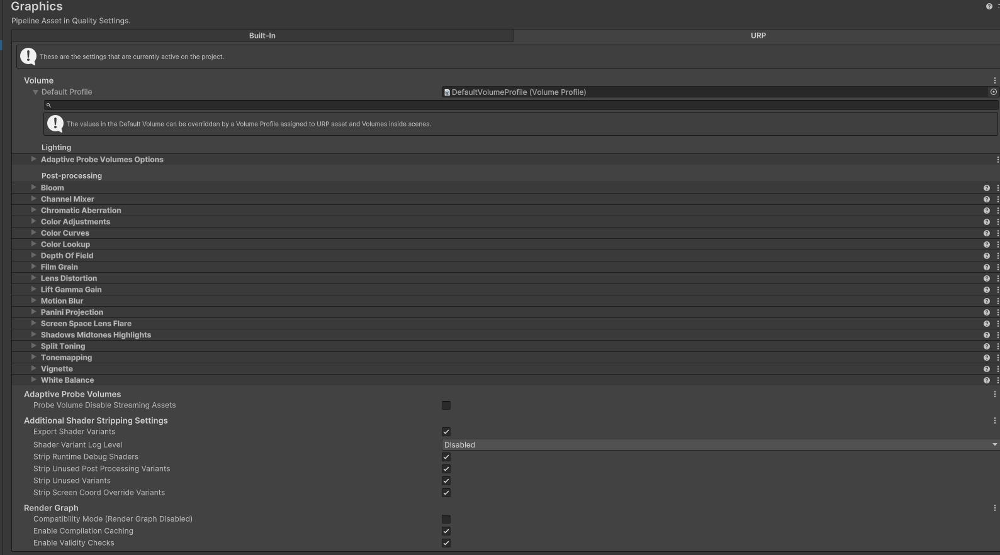
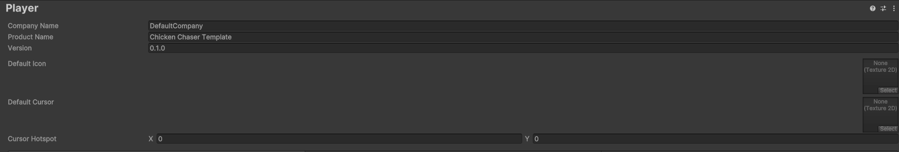
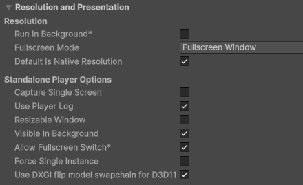
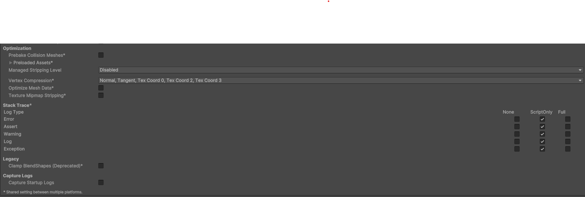
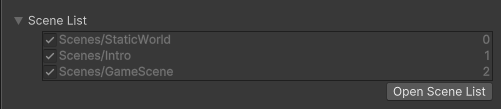
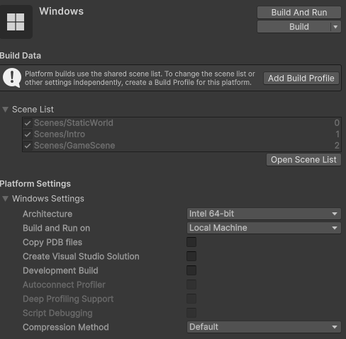
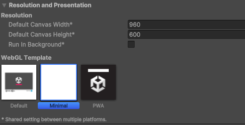
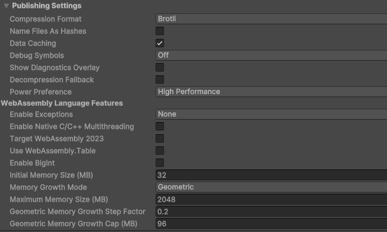

# Managing Builds

To open the build menu:

        Ctrl + Shift + B 

To execute a quick build

        Ctrl + B

It's highly recommended to make a builds folders and label everything carefully. You can replace builds, but in a professional setting you should keep major version changes in different files.

When making builds it's important to go through the settings first.

        Edit->Project Settings

Especially the following files:

* Quality
* Graphics
* Player

---
# Quality (Project Settings)

Quality is used to determine defaults on different devices, and set restrictions. The major detail that's important is the start Quality level and which quality levels are exposed. Keep in mind, each quality level will increase build duration.

---
# Graphics (Project Settings)

Graphics has recently been updated. In unity 6 it now contains all the data of the render pipeline. It's important to make sure the render pipeline is configured properly so that the game is pretty, and to remove effects that are being under utilized. We can also force graphics settings here such as shadows. Shader Stripping can also be a point of error, but it's hard to know until errors pop-up

---
# Player (Project Settings)

The Player is the most important part, it defines how the game will appear as a built project. First are the identifiers.
All of these are important, be sure to configure them correctly.

The next important section is resolution, it describes how the game is windowed, and is especially useful for mobile and web games

The final most important section is Other Settings. 
In here you can strip unnecessary data from the game and set it as a 
published or developer build and do other things such as modifying limits and caches.

It's still recommended to look through the other settings, but these two matter the most.

---
# Build Modes
(Reminder, you can do CTRL + SHIFT + B to open to build menu)

Make sure you have all you scenes numbered and ready before selecting a build mode. The numbers help us figure out how to load scenes numerically.

* [Standalone (Windows / Mac / Linux)](#standalone-windows--mac--linux)
* [Web](#web)
* [iOS](#ios)
* [Android](#android)
---

## Standalone (Windows / Mac / Linux)

### Requirements
You have a PC / Virtual Machine of the platform you're trying to build for
### How to build
Press build and wait. If your code has no errors, it should compile successfully.

### Publishing

* [Publish on Itch](https://itch.io/developers) [FREE]

* [Publish on Steam](https://partner.steamgames.com/steamdirect) [100$]

* [Publish on Epic](https://store.epicgames.com/en-US/news/epic-games-store-launches-self-publishing-tools-for-game-developers-and-publishers) [100$]

---
## Web
### Requirements
The game cannot be HDRP
### How to build

In the build menu select Web. If the option is disabled, you may need to download the web module from Unity Hub.

When building for web, be sure to change the games resolution in the Player->Presentation settings

Also look at Publishing Settings as a common source of build errors is how the game was compressed.
if Brotli fails, try GZip, then No Compression... If none of those help the issue was likely elsewhere, but compression is a common reason why the game won't work on sites like Itch.io

### Publishing
*  [Publish on Itch](https://itch.io/developers) [FREE]

---
## iOS
### Requirements
You need a mac AND iPhone/iPad to publish,
The game cannot be HDRP

### How to build

On your mac, connect your phone to your computer. You then need to install xcode, cocoa pods and enable developer settings. Finally, you should be able to build onto your phone

[Here's a second resource because iOS is the worst platform for builds](https://docs.unity3d.com/Manual/iphone-BuildProcess.html)

Finally, when building the app choose your phone as the selected target

Be sure when building for any mobile platform to check the resolution and presentation settings so you can apply screen locks

### Publishing
* [iOS Developer account](https://developer.apple.com/programs/) [100$/yr]

## Android

### Requirements
You need an android phone,
The game cannot be HDRP
### How to build

On your phone enable developer settings... Unfortunately this is different on many androids but here's a reference.

[Developer Mode](https://developer.android.com/studio/debug/dev-options)

Connect the phone to your PC with USB debugging enabled, and on your PC allow it's connection with files changes.

Finally, when building the app choose your phone as the selected target

Be sure when building for any mobile platform to check the resolution and presentation settings so you can apply screen locks

### Publishing
[Google play developer account](https://developer.android.com/) [25$]

